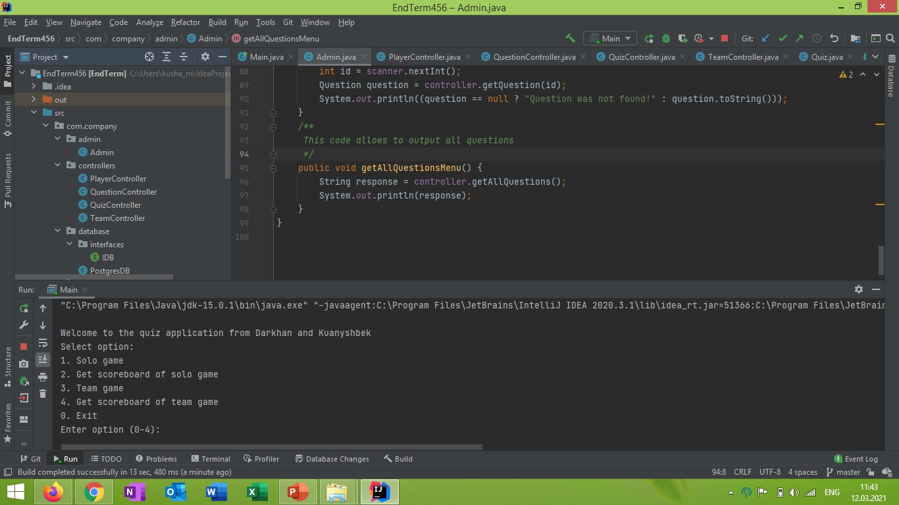

# Quiz Management System 
> Intellectual quiz game for teams and for solo play.

[![NPM Version][npm-image]][npm-url]
[![Build Status][travis-image]][travis-url]
[![Downloads Stats][npm-downloads]][npm-url]

Our program is designed for intellectual games. You can take the test either alone or in team mode for 2 people. You can create a maximum of 4 teams of 2 people. There is a main administrator who can add questions, view questions separately with answers, or can display the entire list of questions from the database. Participants can view their results after each game.

